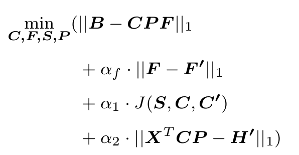

# MIMOsolver

This directory is part of the repository

https://github.com/CMUSchwartzLab/FISH_deconvolution

that contains a software (**M**ultiple **I**nference with **m**iFISH **O**ptimizer (MIMO)) to solve several formulations of the problem of deconvolving bulk tumor data with assistance of single-cell sequencing and FISH data into subpopulations, as described in (Lei et al., in preparation).  Much of the documentation below assumes thatthe user has at least skimmed the manuscript and is familiar with the terminology therein.

In short, this repository contains implementations of an extended model improved based on our pervious work. The exteneded model uses the information from FISH data, which are described in the manuscript,
and simulated data that may be used to test these problems.  It also
contains scripts that _could_ be used to produce the semi-simulated
data and figures in the paper.  These scripts are provided as
documentation of what was done, but the semi-simulated data is based
on human subjects data, which cannot be redistributed.  Thus, most
users will probably want to try the deconvolution algorithms on
fully-simulated data, which we describe in [../data/README.md](../data/README.md)

The main programs that a user may want to try are:

* **simulation.py** [simulate many replicates of the hypothetical
    bulk data from the output of SimulateSCS.py or from the observed
    single-cell data]

* **MIMOsolver.py**  [solve the deconvolution problem for each case]
  
* **main.py** [run **MIMOSolver.py** to solve deconvolution problem in desired steps or to convergence ]

The main.py script will typically be the best place to start.

Programs were written initially by Haoyun Lei 
Programs were modified by Haoyun Lei and E. Michael Gertz. 
Programs were testedby Haoyun Lei, E. Michael Gertz., and Alejandro Schaffer.

----------
# Installation

Users should clone the git repository, possibly by typing,
```bash
git clone https://github.com/CMUSchwartzLab/FISH_deconvolution.git
```
Instructions in this README assume a GNU Linux command line or a
Macintosh terminal.  The `git` command above will create a
subdirectory named `FISH_deconvolution`.  The instructions assume that 
the user's current directory is
`FISH_deconvolution/MIMO/MIMOsolver`, in other words the directory that
contains the `README.md` that you are currently reading.

The setup assumes that the user will create another subdirectory
`FISH_deconvolution/MIMO/simulation`.  It is inherent to the
code and documentation that the four subdirectories {LLSolver, data,
test, simulation} are parallel, at the same level.  For scripts that
require a path, the user should always specify an absolute path (a
path that starts with `/`).  We cannot include such paths in this 
document, because they are specific to the user's file system.

The scripts in that end in `.py` must be run using python3, not
python2.  The scripts that end in `.sh` are intended to be run using
bash.  Some programs assume the availability of the Gurobi package
(http://www.gurobi.com/downloads/download-center) to solve
optimization problems. We are also testing SCIP
(https://scip.zib.de/index.php#download) as an alternative to Gurobi,
but all analyses in the manuscript that used an optimization package
were done with Gurobi.  Several programs assume the availability of
the python3 numpy and scipy packages.


---------------------
## simulation.py 
  
This program simulates bulk tumor data with desired number of samples from the single cell sequencing data and gather the information from single cell sequencing data to simulate FISH, then we collect useful simulated information as reference for copy numbers, fractions and ploidies.

Simulation is based on the Geometric Model described in the manuscript and uses a Dirichlet
distribution.  As written, this method requires access to the single
cell data described in the manuscript, which is human subjects data
and cannot be redistributed.  The method is included in this distribution
as supplemental documentation to the manuscript.

The arguments to simulation.py are as follows:

1.  date: allows for different simulations run on different
dates to be stored n different subdirectories (a.k.a. folders)

2.  tumorName: pick a tumor from which you choose the single cell
data; the name of the input files should be
../data/<TumorName>_integer_CNV.csv. 
This is also the name of directory to store the results of this tumor (see the descprition in **main.py** below)

3.  cellNums: choose how many cell clones you want to retrieve from the SCS data, we use 6 in our test


4.  tumor_number: choose how many tumor samples you want to simulate,
in the main experiments in the manuscript, we chose 3 samples in our test

5.  simuNums: how many different case you want to create, we usually created 10 different simulated case

6.  cellNoise: the noise level you want to add into the copy number, we add 10% (0.1) for the robust test in our paper

7.  ploidy: 2 or random, if you choose 2, then all the cell clones will be assigned ploidy of 2, if you choose random, the cell clones would assigned ploidy from [0, 1, 2, ..., 8] according to some distribution described in the paper.

Example calls to simulation.py can be found in the scripts

* MIMO/tests/simulate_command.sh 1_30_1 GBM07 6 3 10 0 2
* MIMO/tests/simulate_command.sh 1_30_1 GBM33 6 3 10 0 2

We also provided a command line to run the command above in [../tests/run_simulate_command.sh](../tests/run_simulate_command.sh)


After running simulation.py the folder/subdirectory structure
should be abstractly as follows:
```
/some/path/to/the/ParentDirectory:
                                  /data
                                  /MIMOsolver/simulation.py
                                           /MIMOSolver.py
                                           /....
                                           
                                  /simulation/DateFolder/GBM07/3/simulateData1
                                                                /simulateData2
                                                                ...
                                                                /simulateDataN
                                                                
                                  /tests/<CommandLine1>.sh
                                        /<CommandLine2>.sh
                                        ...
                                        /<CommandLineN>.sh
                                       
```

`<CommandLine>.sh` through `<CommandLine>.sh` are abstract names for the shell scripts that call different .py file in **MIMOsolver** directory

-------------------
## MIMOsolver.py

This is the core program that solve one problem by applying coordinate descent algorithm. In general we are optimizing: 



which is non-convex, we solve **F**, **S**, **C**，**P** iteratively to reach an opimization:
* **updateProportion**: step to optimize F while fixing **S**, **C**, **P**
* **updateTree**: step to optimize S while fix **F**, **C**, **P**
* **updateCopyNum**: step to optimize C while fixing **F**, **S**, **P**
* **updatePloidy**: step to optimize P while fixing **F**, **S**, **C**

Each step contain different constraints, for more information, please refer to the methods section in paper and supplementary material.

-------------------
## main.py

This is the main program that decomposes the bulk tumor data to
resolve the copy number in 9934 loci in each fundamental cell type and infer the corresponding fraction and ploidy. 
The code will retrieve the simulation data and implement different reference information if you set up the input arguments correctly (see below)

main.py will use [Gurobi](https://www.gurobi.com/) (we are soon to provide SCIP solver available) to solve the tumor decomposition problem. The detailed code for these methods
are in

  * MIMOsolver.py


though the user should not invoke these files directly.
`MIMOsolver` solves the Mixed Integer Linear Programming problem in a coordinate descent manner.

The code will solve all the problems from `simulateData1` to
`simulateDataN` in each subfolder of tumor samples when you specify the name of tumor samples, e.g. if the name of tumor samples is GBM07, it will solve all the simulateData saved in the folder and save the results for each of the simulateData


  * **simulateDateFolder**: you may do different simulation at different time, this is just for you to specify which simulated data from **simulation** directory you are running the model on

  * **outputDateFolder**: this specifies the directory you want to save the results.  It may or may not the same as the simulateDataFolder since you would run the model on the same simulated data at different time. This results would be saved into subdirectory in **results** directory.

  * **alpha_f**: the regularization value for ||F-F'||, if 0.0 is set, no F penalty will be applied, we choose 0.2 if we want this regularization to be effective.

  * **alpha_1**: the regularization value for J(S,C,C'), if 0.0 is set, no phylogeny penalty will be applied, we choose 0.2 if we want this regularization to be effective.
  
  * **alpha_2**: the regularization value for ||X^TCP-H||, if 0.0 is set, no ploidy penalty will be applied, we choose 0.2 if we want this regularization to be effective.
  * **offset**: index of the data to start from. 
  * **limit**: number of data to run, starting from data[offset]
  * **mask**: percentage of genomic interval to be chosen, we use all avaiable genomic loci for now (mask=1)

Please note that **offset** and **limit** provide a convenient way to slice the whole simulated dataset, so it would possible to run the model the in parallel with different slicing choices.


The folder structure will be as following:
```
  /some/path/to/the/ParentDirectory:
                                  /data/
                                  /MIMOsolver/simulation.py
                                           /MIMOsolver.py
                                           /....

                                  /simulation/DateFolder/GBM07/3/<simulateData1>.mat
                                                                /<simulateData2>.pkl
                                                                ...
                                                                /<simulateDataN>.pkl

                                  /tests/<CommandLine1>.sh
                                        /<CommandLine2>.sh
                                        ...
                                        /<CommandLineN>.sh
                                       

                                  /results/DataFolder/raw_result_for_simulateData1
                                                     /statistic_result_for_simulateData1
                                                                 ...
                                                     /raw_result_for_simulateDataN
                                                     /statistic_result_for_simulateDataN


```


--------------
In the git repository, the directories
* schwartzlab/tests

we wrap all the argument of calling `main.py` in a .sh file [../tests/MIMOsolver_command.sh](../tests/MIMOsolver_command.sh) and then call that .sh file to call `main.py`. We also provide one example [../tests/run_MIMOsolver_command.sh](../tests/run_MIMOsolver_command.sh) of what command could look like.
Briefly, a call to `main.py` should look something like
```bash
bash MIMOsolver_command.sh 1_30_1 1_30_1 0.2 0.2 0.2 0 10 gurobi 1
```

Please note that the structure of **results** is incomplete yet that does not ditinguish GBM07 or GBM33 since we are working on GBM07 for now, so we assume the model are running only on GBM07 simulated data. Later updates to change the output directory are needed.


Reference:

Haoyun Lei, E. Michael Gertz, Alejandro A. Schaffer, Heselmeyer-Haddad, Irianna Torres, 
Xulian Shi, Kui Wu, Guibo Li, Liqin Xu, Yong Hou, Michael Dean, Thomas Ried
Russell Schwartz, _Tumor heterogeneity assessed by sequencing and fluorescence 
in situ hybridization (FISH) data_, in preparation.
