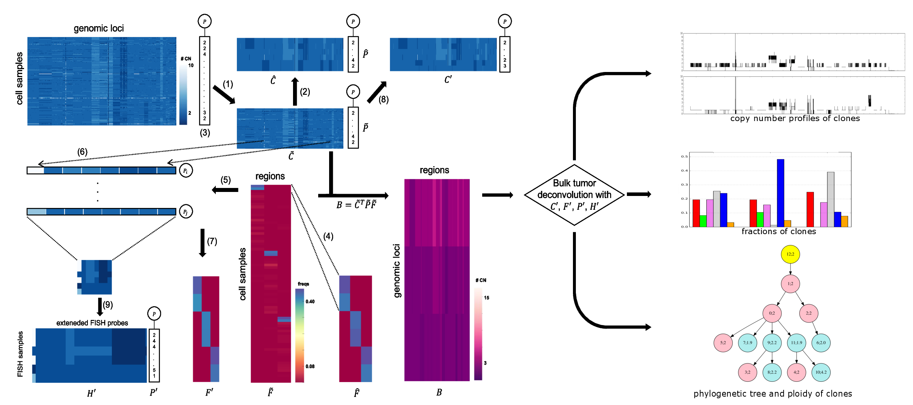

This is the top level directory for the repository

https://github.com/CMUSchwartzLab/SCS_FISH

that contains a software (**M**ultiple **I**nference with **m**iFISH **O**ptimizer (MIMO)) to solve several formulations of the problem of deconvolving bulk tumor data with assistance of single-cell sequencing and FISH data into subpopulations, as described in (Lei et al., in preparation)

Code and more information can be found in the subdirectory 
MIMO/MIMOsolver including a longer documentation file called
[MIMO/MIMOsolver/README.md](MIMO/MIMOsolver/README.md).

*The work flow of the model*: we simulated ground truth from real Single-cell sequencing (SCS) data and deconvolve the bulk tumor with the simulated information to accurately infer the tumor heterogeneity, for more details, please refer to the paper.

Reference:

Haoyun Lei, E. Michael Gertz, Alejandro A. Schaffer, Heselmeyer-Haddad, Irianna Torres, 
Xulian Shi, Kui Wu, Guibo Li, Liqin Xu, Yong Hou, Michael Dean, Thomas Ried
Russell Schwartz, _Tumor heterogeneity assessed by bulk sequencing and fluorescence 
in situ hybridization (FISH) data_, in preparation.
